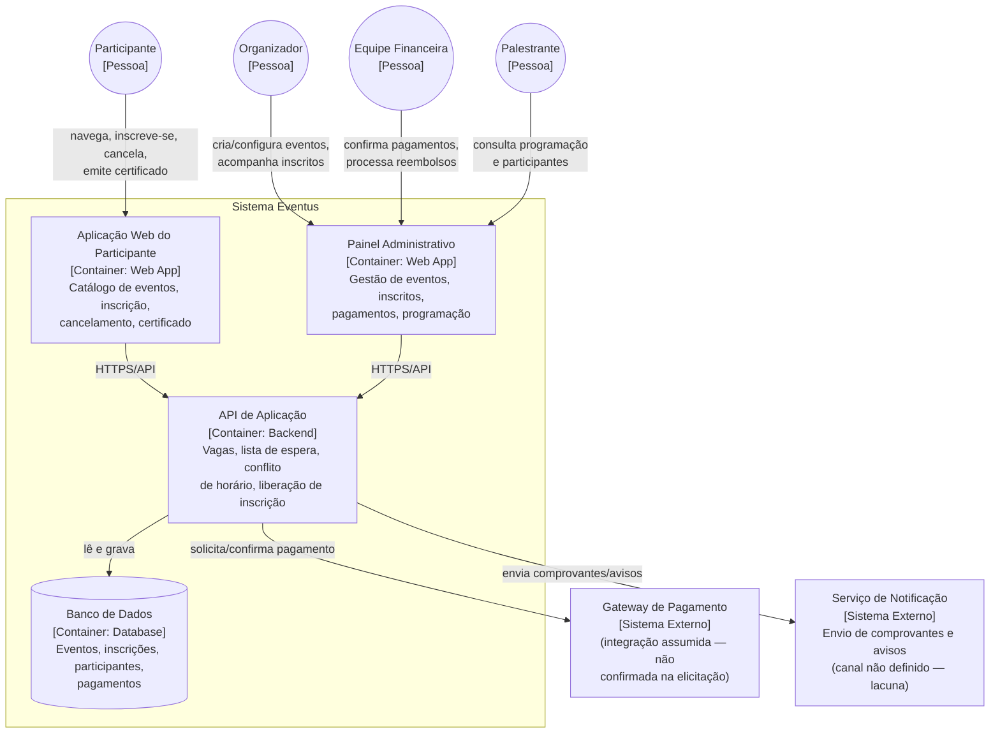

# Diagrama de Containers — Eventus

> Visão estrutural (inspirada no C4, nível 2), gerada com apoio de GenAI a
> partir de `../descricao-sistema.md`. Mostra as aplicações/serviços que
> compõem o Eventus, os quatro papéis que os utilizam e as integrações
> externas envolvidas.

