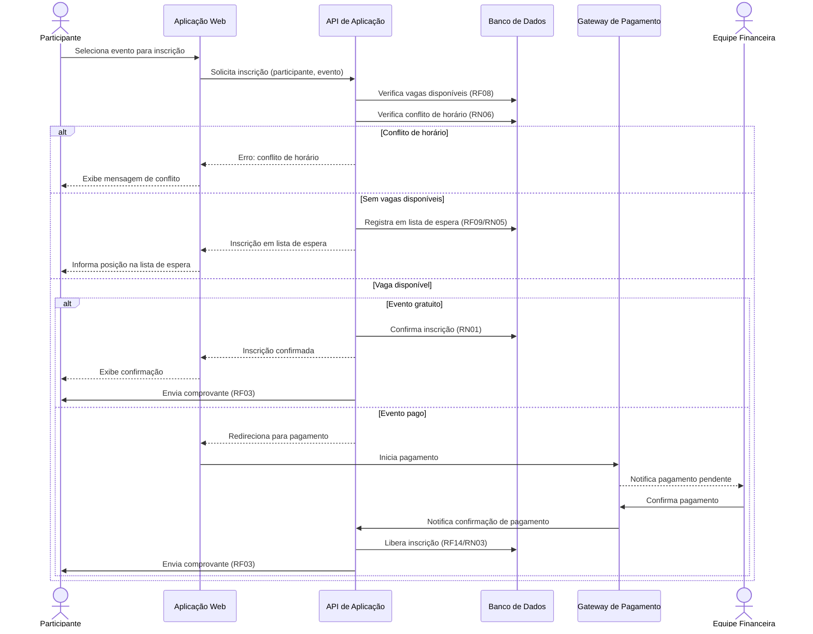

# Diagrama de Sequência — Inscrever-se em Evento

> Visão comportamental de uma jornada crítica, gerada com apoio de GenAI a
> partir do Caso de Uso 1 (`../../especificacao/casos-de-uso.md`).
> Escolhida por concentrar a maior parte das regras de negócio do sistema:
> controle de vagas, lista de espera, conflito de horário e os dois fluxos
> de pagamento (gratuito e pago).

